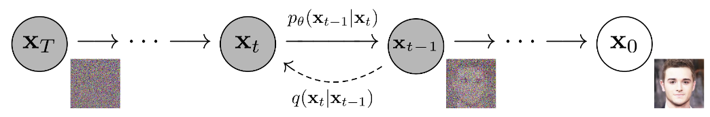
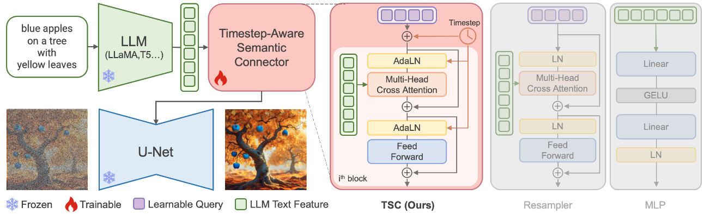
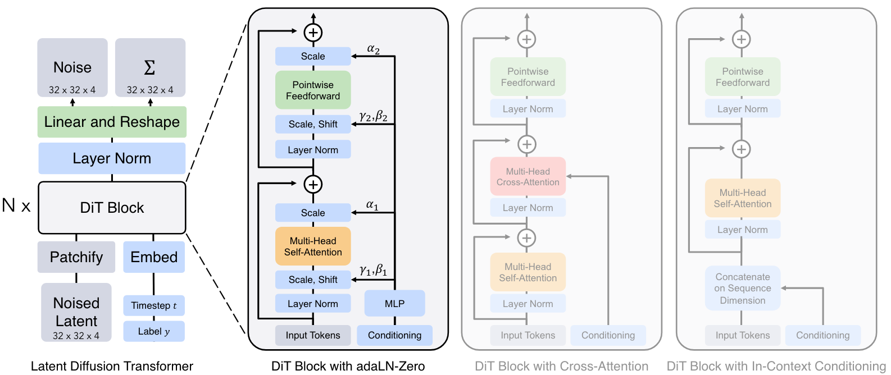
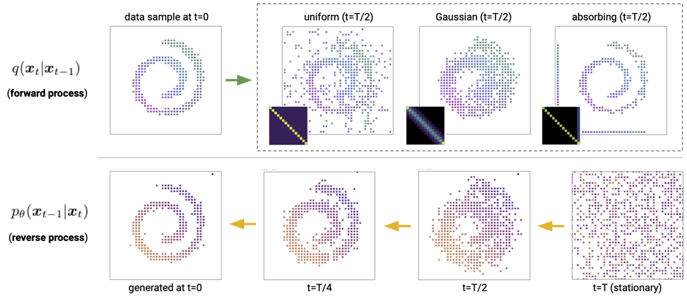

  <h1 align="center">Topics</h1>

This section summarizes papers that are highly related to T2I generation according to different properties, *e.g., prerequisites of T2I generation, diffusion models with other techniques (e.g., Diffusion Transformer, LLMs, Mamba, etc.), and diffusion models for other tasks.* 

All references of the summarized papers can be found in [`reference.bib`](../reference.bib).

[<u><small><🎯Back to Homepage></small></u>](../README.md)

<!-- omit in toc -->
# Contents
- [Prerequisites](#prerequisites)
- [Diffusion Models Meet LLMs](#diffusion-models-meet-llms)
- [Diffusion Models Meet Mamba](#diffusion-models-meet-mamba)
- [Diffusion Transformer-based Methods](#diffusion-transformer-based-methods)
- [Diffusion Models for Text Generation](#diffusion-models-for-text-generation)

<!-- omit in toc -->
# Prerequisites

> [!NOTE]
> The `Prerequisites` section summarizes the essential background knowledge for text-to-image diffusion models, *e.g., DDPM, DDIM, classifier-free guidance, latent diffusion models, etc.*

- [NeurIPS 2020] ***DDPM:*** Denoising Diffusion Probabilistic Models [[Paper]](https://arxiv.org/pdf/2006.11239.pdf) [[Code]](https://github.com/hojonathanho/diffusion) [[Project]](https://hojonathanho.github.io/diffusion/)
- [ICLR 2021] ***DDIM:*** Denoising Diffusion Implicit Models [[Paper]](https://arxiv.org/pdf/2010.02502.pdf) [[Code]](https://github.com/ermongroup/ddim)
- [NeurIPS 2021] ***Classifier Guidance:*** Diffusion Models Beat GANs on Image Synthesis [[Paper]](https://arxiv.org/pdf/2105.05233.pdf) [[Code]](https://github.com/openai/guided-diffusion)
- [arXiv 2022] ***Classifier-Free Diffusion Guidance*** [[Paper]](https://arxiv.org/pdf/2207.12598.pdf) [[Reproduced Code]](https://github.com/lucidrains/classifier-free-guidance-pytorch)

<!-- omit in toc -->
# Diffusion Models Meet LLMs

> [!NOTE]
> Large Language Models (LLM) have become a popular research direction with outstanding text processing ability. This topic summarizes diffusion models that integrate LLMs.

- [arXiv 2023] ***ParaDiffusion:*** Paragraph-to-Image Generation with Information-Enriched Diffusion Model [[Paper]](https://arxiv.org/pdf/2311.14284) [[Code]](https://github.com/weijiawu/ParaDiffusion)
- [arXiv 2023] ***MiniGPT-5:*** Interleaved Vision-and-Language Generation via Generative Vokens [[Paper]](https://arxiv.org/pdf/2310.02239)
- [ACM MM 2024] ***SUR-adapter:*** Enhancing Text-to-Image Pre-trained Diffusion Models with Large Language Models [[Paper]](https://arxiv.org/pdf/2305.05189.pdf) [[Code]](https://github.com/Qrange-group/SUR-adapter)
- [arXiv 2024] ***ELLA:*** Equip Diffusion Models with LLM for Enhanced Semantic Alignment [[Paper]](https://arxiv.org/pdf/2403.05135) [[Code]](https://github.com/ELLA-Diffusion/ELLA) [[Project]](https://ella-diffusion.github.io/) 

<!-- omit in toc -->
# Diffusion Models Meet Mamba

> [!NOTE]
> Mamba is a new state space model architecture with amazing performance on information-dense data, e.g., language modeling. This topic summarizes those papers that integrate Mamba with diffusion models.

- [arXiv 2023] ***Mamba:*** Linear-Time Sequence Modeling with Selective State Spaces [[Paper]](https://arxiv.org/pdf/2312.00752) [[Code]](https://github.com/state-spaces/mamba)
- [arXiv 2024] ***DiS:*** Scalable Diffusion Models with State Space Backbone [[Paper]](https://arxiv.org/pdf/2402.05608) [[Code]](https://github.com/feizc/DiS)
- [arXiv 2024] ***ZigMa:*** Zigzag Mamba Diffusion Model [[Paper]](https://arxiv.org/pdf/2403.13802v1) [[Code]](https://github.com/CompVis/zigma) [[Project]](https://taohu.me/zigma/)

<!-- omit in toc -->
# Diffusion Transformer-based Methods

> [!NOTE]
> Diffusion Transformer (DiT) aims to use Transformer-based architecture to improve the backbone model (i.e., U-net) of diffusion models, where these architecture has been adopted by a wide series of related works, *e.g., Sora, Stable Diffusion 3, PixArt series, etc.* This topic summarizes diffusion models that are based on DiT.

- [ICCV 2023] ***DiT:*** Scalable Diffusion Models with Transformers [[Paper]](https://arxiv.org/pdf/2212.09748) [[Code]](https://github.com/facebookresearch/DiT) [[Project]](https://www.wpeebles.com/DiT) [[Demo]](https://huggingface.co/spaces/wpeebles/DiT)
- [ICML 2023] ***UniDiffusers:*** One Transformer Fits All Distributions in Multi-Modal Diffusion at Scale [[Paper]](https://arxiv.org/pdf/2303.06555) [[Code]](https://github.com/thu-ml/unidiffuser)
- [ICCV 2023] ***MDTv1:*** Masked Diffusion Transformer is a Strong Image Synthesizer [[Paper]](https://openaccess.thecvf.com/content/ICCV2023/papers/Gao_Masked_Diffusion_Transformer_is_a_Strong_Image_Synthesizer_ICCV_2023_paper.pdf) [[Code]](https://github.com/sail-sg/MDT)
- [ICLR 2024] ***PixArt-α:*** Fast Training of Diffusion Transformer for Photorealistic Text-to-Image Synthesis [[Paper]](https://arxiv.org/pdf/2310.00426.pdf) [[Code]](https://github.com/PixArt-alpha/PixArt-alpha) [[Project]](https://pixart-alpha.github.io/) [[Demo]](https://huggingface.co/spaces/PixArt-alpha/PixArt-alpha)
- [TMLR 2024] ***MaskDiT:*** Fast Training of Diffusion Models with Masked Transformer [[Paper]](https://openreview.net/pdf?id=vTBjBtGioE) [[Code]](https://github.com/Anima-Lab/MaskDiT)
- [arXiv 2024] ***FiT:*** Flexible Vision Transformer for Diffusion Model [[Paper]](https://arxiv.org/pdf/2402.12376) [[Code]](https://github.com/whlzy/FiT)
- [arXiv 2024] ***PIXART-δ:*** Fast and Controllable Image Generation with Latent Consistency Models [[Paper]](https://arxiv.org/pdf/2401.05252) [[Code]](b.com/PixArt-alpha/PixArt-alpha?tab=readme-ov-file)
- [arXiv 2024] ***PixArt-Σ:*** Weak-to-Strong Training of Diffusion Transformer for 4K Text-to-Image Generation [[Paper]](https://arxiv.org/pdf/2403.04692) [[Code]](https://github.com/PixArt-alpha/PixArt-sigma) [[Project]](https://pixart-alpha.github.io/PixArt-sigma-project/)
- [arXiv 2024] ***MDTv2:*** Masked Diffusion Transformer is a Strong Image Synthesizer [[Paper]](https://arxiv.org/pdf/2303.14389.pdf) [[Code]](https://github.com/sail-sg/MDT)

<!-- omit in toc -->
# Diffusion Models for Text Generation

> [!NOTE]
> Diffusion models are utilized for text generation to tackle the limitation of autoregressive models, e.g., Transformer. However, it is tough to directly leverage standard diffusion models for text generation due to the discrete nature of natural language. Therefore, related works, *e.g., D3PM, Bit Diffusion, Diffusion-LM, etc.*, are motivated to tackle the aforementioned problems. This topic summarizes diffusion models that are designed for text generation.

- [NeurIPS 2021] ***D3PM:*** Structured Denoising Diffusion Models in Discrete State-Spaces [[Paper]](https://arxiv.org/pdf/2107.03006.pdf)
- [NeurIPS 2022] ***Diffusion-LM*** Improves Controllable Text Generation [[Paper]](https://openreview.net/pdf?id=3s9IrEsjLyk) [[Code]](https://github.com/XiangLi1999/Diffusion-LM)
- [arXiv 2022] ***DDCap:*** Exploring Discrete Diffusion Models for Image Captioning [[Paper]](https://arxiv.org/pdf/2211.11694) [[Code]](https://github.com/buxiangzhiren/DDCap)
- [ACL 2023] ***DiffusionBERT:*** Improving Generative Masked Language Models with Diffusion Models [[Paper]](https://aclanthology.org/2023.acl-long.248.pdf) [[Code]](https://github.com/Hzfinfdu/Diffusion-BERT)
- [ICLR 2023] (***Bit Diffusion***) Analog Bits: Generating Discrete Data using Diffusion Models with Self-Conditioning [[Paper]](https://openreview.net/pdf?id=3itjR9QxFw) [[Reproduced Code]](https://github.com/lucidrains/bit-diffusion)
- [CVPR 2023] ***SCD-Net:*** Semantic-Conditional Diffusion Networks for Image Captioning [[Paper]](https://openaccess.thecvf.com/content/CVPR2023/papers/Luo_Semantic-Conditional_Diffusion_Networks_for_Image_Captioning_CVPR_2023_paper.pdf) [[Code]](https://github.com/jianjieluo/SCD-Net)
- [ICLR 2023] ***DiffuSeq:*** Sequence to Sequence Text Generation with Diffusion Models [[Paper]](https://openreview.net/pdf?id=jQj-_rLVXsj) [[Code]](https://github.com/Shark-NLP/DiffuSeq)
- [arXiv 2023] ***DiffuSeq-v2:*** Bridging Discrete and Continuous Text Spaces for Accelerated Seq2Seq Diffusion Models [[Paper]](https://arxiv.org/pdf/2310.05793.pdf) [[Code]](https://github.com/Shark-NLP/DiffuSeq/tree/diffuseq-v2)
- [arXiv 2023] ***DiffCap:*** Exploring Continuous Diffusion on Image Captioning [[Paper]](https://arxiv.org/pdf/2305.12144)
- [arXiv 2023] ***GlyphDiffusion:*** Text Generation as Image Generation [[Paper]](https://arxiv.org/pdf/2304.12519) 